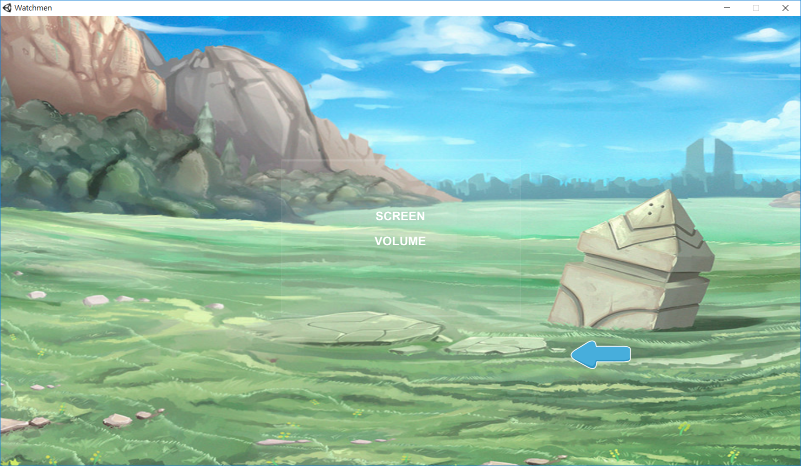

# 組別:第18組
## 成員:0424085 葉柏廷 0424032 崔恩偉 0424046李俊岳
### 專題題目:橫向卷軸遊戲設計
#### 指導教授:黃文楨 教授
##### 專題內容:以類惡魔城為基礎設計一款橫向卷軸動作遊戲
# 介面:

# 場景概念:

### 功能性需求:
###### 1.角色和敵人能夠順暢移動
###### 2.Hitbox判定：受到傷害或者觸發物件條件設定
###### 3.轉場：達到畫面邊界時背景及平台能變化
###### 4.血量：判斷主角或敵人是否存活
###### 5.觸發事件：例如:碰到特定物件、持有某項道具才能通過
###### 6.存檔功能
###### 7.使用者系統設定
### 非功能性需求:
###### 1.主角、敵人動畫
###### 2.平台材質
###### 3.前景、背景設計
###### 4.UI設計
###### 5.降低硬體需求

### 甘特圖

# 個人工作分配
## 崔恩偉 李俊岳
## https://drive.google.com/file/d/1K3l_FNNStXYIvfwGs6BZMYC1i31yimeE/view
## 葉柏廷
### 角色動畫

## 角色設計

